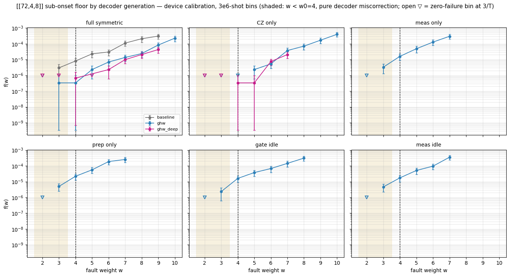

# The sub-onset decoder floor, across three decoder generations

**What this shows.** The [[72,4,8]] circuit distance is 8, so the perfect-decoder onset
is $w_0 = \lceil D/2 \rceil = 4$: with three or fewer faults, a min-weight decoder is
*guaranteed* to succeed. Any failure at $w \le 3$ is therefore decoder miscorrection —
a floor that no property of the code explains, and one that dominates the logical error
rate at low physical error rates, because weight-3 faults are so much more common than
weight-8 ones.

**Why it took work to see.** These rates are around $10^{-6}$. The campaign's adaptive
sampler caps low-weight bins at 10,000 shots, which cannot resolve them at all — every
such bin comes back empty and looks clean. The numbers here come from dedicated
3,000,000-shot top-up passes on each bin, which is the only way the floor becomes
visible rather than merely bounded.

**The three decoders**, all Relay-BP, all calibrated on the full-symmetric circuit at
p* = 5e-4 (the device convention, one decoder per code):

| generation | configuration |
|---|---|
| `baseline` | the campaign's original: `num_sets=20, pre_iter=80, gamma0=0.125` |
| `ghw` | hand-tuned for sub-onset: `pre_iter=320, num_sets=200, wide gamma interval` |
| `ghw_deep` | found by the automated decoder loop: `pre_iter=640, num_sets=1200` |


```python
from emc_report import fig_decoder_generations, decoder_generations_table
```

## The floor, by model and decoder

Filled markers are measured rates with 95% binomial intervals. Open triangles are
zero-failure bins, drawn at their rule-of-three upper bound $3/T$ — a bound, not a
measurement. Bins with fewer than 100,000 shots are omitted entirely rather than
plotted, so generation-depth data cannot masquerade as a resolved rate.


```python
fig_decoder_generations()
```


    

    


## The same numbers, with denominators

Every figure above should be checkable against a count and a shot budget.


```python
decoder_generations_table()
```

    
    === baseline ===
    model                         w=2               w=3               w=4               w=5
    full_symmetric      0/3,000,000       9/3,010,000      20/2,460,000      21/910,000    
    
    === ghw ===
    model                         w=2               w=3               w=4               w=5
    full_symmetric      0/3,000,000       1/3,000,000       1/3,000,000       7/3,000,000  
    CZ_only             0/3,000,000       0/3,010,000       0/3,010,000       7/3,010,000  
    meas_only           0/3,010,000      10/3,010,000      21/1,310,000      20/410,000    
    prep_only           0/3,010,000      15/3,010,000      21/960,000        23/410,000    
    gate_idle           0/3,000,000       7/3,000,000      20/1,250,000      21/560,000    
    meas_idle           0/3,000,000      14/3,010,000      21/1,210,000      21/410,000    
    
    === ghw_deep ===
    model                         w=2               w=3               w=4               w=5
    full_symmetric      0/3,000,000       0/3,000,000       2/3,000,000       0/3,000,000  
    CZ_only             0/3,000,000       0/3,000,000       1/3,010,000       1/3,010,000  
    meas_only               —                 —                 —                 —        
    prep_only               —                 —                 —                 —        
    gate_idle               —                 —                 —                 —        
    meas_idle               —                 —                 —                 —        
    
    (bins with < 100,000 trials shown as — : generation depth cannot resolve a 1e-6-class rate)
    

## Reading it

* **w = 2 is clean everywhere** — zero failures across millions of shots for every
  decoder and every channel. Two faults never defeat these decoders.
* **The floor is channel-specific.** Under `ghw`, CZ-only contributes nothing at w = 3
  while prep, meas-idle and meas dominate — an attribution that only exists because the
  channels were measured separately at depth.
* **The floor shrinks by generation.** On full symmetric the w = 3 bin goes
  9 → 1 → 0 failures per three million shots.
* **w = 4 is not a defect.** It is exactly $D/2$, where the true fault and its
  complement have equal weight: even a perfect decoder fails a finite fraction there,
  so small differences between decoders at w = 4 are ties, not regressions.
* **Bounds are not zeros.** An open triangle means "no failures in T shots", i.e.
  f(w) < 3/T at 95% confidence — consistent with a small non-zero rate.
