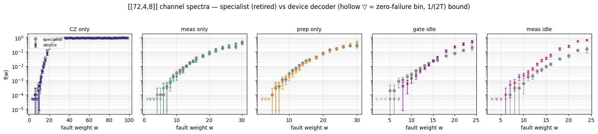

# Device-calibration transition — priors vs structure on the [[72,4,8]] channels

**The convention change (2026-07-31, commits 3916611b/da2ae43d):** the legacy campaign
calibrated each error-model task's decoder priors on that task's OWN noise model — so
"meas only" was decoded by a decoder that believed only measurement errors exist. That
specialist is not the device's decoder, and the per-channel rows never answered the
error-budget question. Under `EMC_CALIB=device` every model and ablation of a code is
decoded by ONE decoder calibrated on the full-symmetric circuit at p* = 5e-4 (the ×5
asym rays keep their own full-asym device decoder). The legacy sub-model results were
retired to `runs/_retired_permodel_calib/` — kept only so this notebook can measure the
priors effect by differencing.

**Reading:** same circuits, same sampling — every device-vs-specialist difference below
is purely the decoder's priors. |z| > 2 marks real effects. Bins deepen as the rodan
device campaign + specimen top-up merge in; re-execute to tighten.


```python
from emc_report import DevTransition
D = DevTransition()
D.load()
```

    loaded 5 channels x (device, specialist) + full-sym anchors; 0/5 device channels have top-up bins so far
    

## 1. Channel spectra — specialist (retired) vs device decoder

First finding (generation-depth bins): the priors effect is channel-dependent, and it
moves the error budget's ordering — **gate idle** decodes 2–3× BETTER under the device
decoder (cross-channel context helps; the legacy data overstated its budget share),
while **meas idle** decodes 2–6× WORSE (it genuinely benefited from specialist priors;
the legacy data understated it). CZ and prep show no priors effect.


```python
D.fig_channels()
```


    

    


```python
D.ratio_table()
```

    channel        w         device     specialist   ratio      z
    CZ only        6      1/10000         1/10000      1.00    0.0
    CZ only        7      0/10000         1/10000      n/a    -0.7
    CZ only        9      2/10000         3/10000      0.67   -0.4
    CZ only       10      4/10000         2/10000      2.00    0.8
    CZ only       11      8/10000         6/10000      1.33    0.5
    CZ only       12     17/10000        21/10000      0.81   -0.6
    CZ only       13     46/10000        45/10000      1.02    0.1
    CZ only       14     90/10000       103/9350       0.82   -1.4
    CZ only       15     88/5931         80/4185       0.78   -1.6
    CZ only       16     78/2817         48/1277       0.74   -1.6
    CZ only       18     54/722          64/533        0.62   -2.5
    CZ only       20     77/382         116/411        0.71   -2.3
    CZ only       22     95/253          73/209        1.08    0.5
    CZ only       24     71/147          81/140        0.83   -1.1
    CZ only       26    100/137          85/110        0.94   -0.4
    CZ only       28    100/125         100/113        0.90   -0.7
    CZ only       30     91/108         112/121        0.91   -0.7
    CZ only       32     94/100          90/104        1.09    0.6
    CZ only       34    102/107         101/106        1.00    0.0
    CZ only       36    111/116         101/105        0.99   -0.0
    CZ only       38     91/103          96/102        0.94   -0.4
    CZ only       40    103/109         105/108        0.97   -0.2
    CZ only       42    109/116         103/111        1.01    0.1
    CZ only       44     93/104         100/108        0.97   -0.2
    CZ only       46     98/104          97/105        1.02    0.1
    CZ only       48    106/110         104/109        1.01    0.1
    CZ only       50     96/104         100/107        0.99   -0.1
    CZ only       52    102/108          98/104        1.00    0.0
    CZ only       54    105/110         100/105        1.00    0.0
    CZ only       56     92/100          98/103        0.97   -0.2
    CZ only       58     98/100         104/111        1.05    0.3
    CZ only       60    104/108         108/116        1.03    0.2
    CZ only       62    107/115          94/107        1.06    0.4
    CZ only       64    100/112         101/107        0.95   -0.4
    CZ only       66     97/107         102/109        0.97   -0.2
    CZ only       68    100/107         103/109        0.99   -0.1
    CZ only       70    104/111          96/103        1.01    0.0
    CZ only       72     99/107         101/104        0.95   -0.3
    CZ only       74     98/106         102/106        0.96   -0.3
    CZ only       76    102/107          99/103        0.99   -0.1
    CZ only       78     99/108          96/101        0.96   -0.3
    CZ only       80    108/115         108/110        0.96   -0.3
    CZ only       82    100/112          97/105        0.97   -0.2
    CZ only       84     98/106         102/109        0.99   -0.1
    CZ only       86     97/103         105/111        1.00   -0.0
    CZ only       88    106/108          94/103        1.08    0.5
    CZ only       90     96/101         103/107        0.99   -0.1
    CZ only       92     97/100         103/109        1.03    0.2
    CZ only       94    106/107          99/106        1.06    0.4
    CZ only       96    100/106         100/105        0.99   -0.1
    CZ only       98     95/100          96/100        0.99   -0.1
    meas only      4      1/10000         0/10000      n/a     0.7
    meas only      5      0/10000         1/10000      n/a    -0.7
    meas only      6      3/10000         1/10000      3.00    1.0
    meas only      7      3/10000         4/10000      0.75   -0.4
    meas only      8      9/10000         7/10000      1.29    0.5
    meas only      9     17/10000        20/10000      0.85   -0.5
    meas only     10     19/10000        33/10000      0.58   -1.9
    meas only     11     39/10000        52/10000      0.75   -1.4
    meas only     12     46/10000        75/10000      0.61   -2.6
    meas only     13     76/7374         88/8422       0.99   -0.1
    meas only     14    115/6969         87/4827       0.92   -0.6
    meas only     15    113/5245         75/3218       0.92   -0.5
    meas only     16     72/2845        123/3209       0.66   -2.9
    meas only     18     87/1525         95/1959       1.18    1.1
    meas only     20     84/878          85/1111       1.25    1.4
    meas only     22     93/609          74/626        1.29    1.6
    meas only     24    103/484         123/705        1.22    1.5
    meas only     26    108/386         181/838        1.30    2.0
    meas only     28     72/200          54/244        1.63    2.7
    meas only     30     50/100          41/100        1.22    0.9
    prep only      5      1/10000         1/10000      1.00    0.0
    prep only      6      4/10000         3/10000      1.33    0.4
    prep only      7      3/10000         4/10000      0.75   -0.4
    prep only      8      8/10000        11/10000      0.73   -0.7
    prep only      9     16/10000        12/10000      1.33    0.8
    prep only     10     18/10000        30/10000      0.60   -1.7
    prep only     11     29/10000        51/10000      0.57   -2.5
    prep only     12     47/10000        72/10000      0.65   -2.3
    prep only     13     66/9992         89/7510       0.56   -3.5
    prep only     14     87/6527         87/5171       0.79   -1.5
    prep only     15    107/5581        112/4671       0.80   -1.6
    prep only     16    104/4233        114/3997       0.86   -1.1
    prep only     18     81/2106         74/1688       0.88   -0.8
    prep only     20    101/1347         75/937        0.94   -0.4
    prep only     22     85/762         104/757        0.81   -1.4
    prep only     24     90/496          81/492        1.10    0.6
    prep only     26     94/359          85/387        1.19    1.2
    prep only     28     79/223          98/371        1.34    1.9
    prep only     30     45/100          27/100        1.67    2.1
    gate idle      5      0/10000         2/10000      n/a    -1.2
    gate idle      6      0/10000         2/10000      n/a    -1.2
    gate idle      7      0/10000         9/10000      n/a    -2.8
    gate idle      8      4/10000        11/10000      0.36   -1.8
    gate idle      9      6/10000        19/10000      0.32   -2.6
    gate idle     10     14/10000        26/10000      0.54   -1.9
    gate idle     11     22/10000        48/10000      0.46   -3.1
    gate idle     12     49/10000        71/10000      0.69   -2.0
    gate idle     13     79/10000        88/8039       0.72   -2.1
    gate idle     14     91/7140         97/6119       0.80   -1.5
    gate idle     15     86/3585        104/4550       1.05    0.3
    gate idle     16     58/1445         81/2958       1.47    2.1
    gate idle     18     77/654         106/1979       2.20    4.5
    gate idle     20     90/396          94/1184       2.86    5.8
    gate idle     22     70/193          65/500        2.79    5.0
    gate idle     24     52/100          20/100        2.60    3.8
    meas idle      6      1/10000         0/10000      n/a     0.7
    meas idle      7      5/10000         1/10000      5.00    1.6
    meas idle      8      7/10000         3/10000      2.33    1.3
    meas idle      9     18/10000         3/10000      6.00    3.3
    meas idle     10     23/10000         6/10000      3.83    3.2
    meas idle     11     38/10000        18/10000      2.11    2.7
    meas idle     12     65/10000        21/10000      3.10    4.7
    meas idle     13     85/6037         44/10000      3.20    5.8
    meas idle     14    113/4456         58/10000      4.37    7.8
    meas idle     15     84/2234         89/9376       3.96    6.7
    meas idle     16     70/1197         89/6412       4.21    6.2
    meas idle     18     96/585          98/2937       4.92    7.7
    meas idle     20     55/217          49/930        4.81    5.7
    meas idle     22     83/148          82/625        4.27    6.8
    meas idle     24     68/100          16/100        4.25    5.7
    
    z: normal approx on the rate difference; |z|>2 is a real priors effect.
    

## 2. Full-symmetric anchors (convention-invariant)

The full-symmetric model calibrates on itself under BOTH conventions, so the headline
decoder results carry over unchanged: the measured-vs-measured spectra (3e6-shot top-up
bins, w = 2–10 both decoders) and the reweighted LER at p*.


```python
D.anchor_table()
```

    full-symmetric [[72,4,8]] anchors at p* = 0.0005 (convention-invariant):
      baseline : LER = 1.408e-06 ± 1.8e-07   zero-bin headroom +18%
      ghw      : LER = 1.421e-07 ± 4.9e-08   zero-bin headroom +179%
      decoder improvement: 9.9x  (floor 3.6x pricing every ghw zero bin at 3/T)
    

## 3. What re-executes as data lands

* **Device campaign** (rodan `emc_device_s*`): ablations + asym under the device
  decoder — the error-budget sections of the main report regenerate from that dir.
* **Specimen top-up** (`run_sys_topup.sh` on the device dir): deepens the w = 2–10
  channel bins to the 3e6 cap AND records failing mechanism configurations
  (`failure_configs`, ≤200/weight). Under the device convention a sub-model failing
  config IS a full-model failing config — specimens feed the decoder-loop library
  directly (`add_w3_harvest_to_library.py` pattern).
* This notebook's §1 ratios tighten automatically on re-execution; the main report
  copy against the device dir is the final deliverable once the campaign completes.
